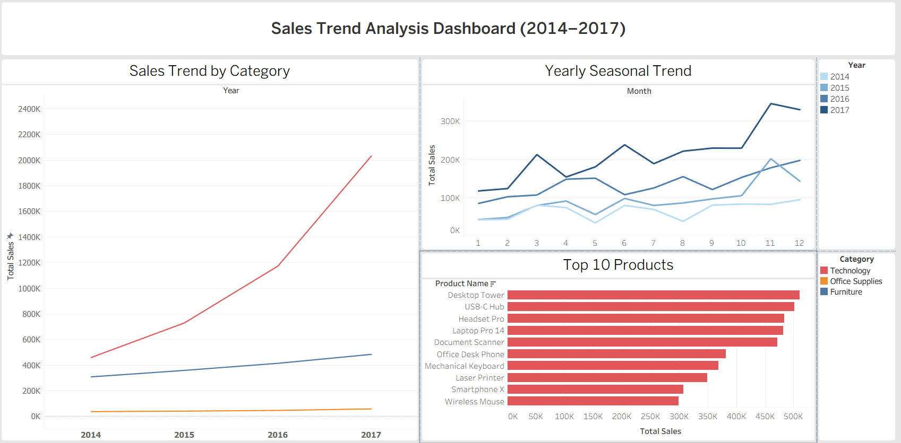

# 📊 Sales Trend Analysis

Analisis tren penjualan ritel (gaya *Superstore*) secara **end-to-end** —
dari data mentah, dimodelkan & dianalisis dengan **SQL (MySQL 8)**, divalidasi
dengan **Python**, dan divisualisasikan sebagai **dashboard interaktif di Tableau**.

> **Project portofolio Data Analyst** (mahasiswa Database Technology, semester 3).
> Pertanyaan utama: *produk & kategori apa yang menunjukkan tren pertumbuhan
> paling kuat dari tahun ke tahun, dan bagaimana pola musimannya?*

🔗 **[Lihat Dashboard Interaktif di Tableau Public](https://public.tableau.com/app/profile/rafael.aprillian.dinata/viz/SalesTrendAnalysis_17913017734970/Dashboard1)**



---

## ❓ Pertanyaan Bisnis

1. 📈 Kategori mana yang tumbuh paling cepat dari tahun ke tahun? (growth rate / YoY)
2. 📅 Apakah ada pola musiman? (bulan apa penjualan paling ramai)
3. 🏆 Produk apa yang paling laku (by unit) vs paling cuan (by revenue)?

---

## 💡 Insight Utama

### 1. Technology adalah mesin pertumbuhan utama
Growth year-over-year (YoY) per kategori:

| Kategori | 2015 | 2016 | 2017 |
|----------|-----:|-----:|-----:|
| 🚀 **Technology** | +58.8% | +60.7% | **+73.2%** |
| 🪑 Furniture | +16.4% | +15.3% | +16.8% |
| 📎 Office Supplies | +10.3% | +12.7% | +25.5% |

Technology tumbuh **~4,4x lipat** dari 2014 ke 2017, dengan laju pertumbuhan yang
terus **meningkat** tiap tahun (accelerating growth) — berbeda dari Furniture &
Office Supplies yang tumbuh stabil tapi jauh lebih lambat. Di 2017, penjualan
Technology (±2 juta) **melampaui gabungan dua kategori lain** (±544 ribu).

➡️ *Rekomendasi: prioritaskan inventory, marketing budget, dan ekspansi lini
produk ke kategori Technology.*

### 2. Pola musiman: puncak di kuartal akhir tahun
Penjualan memuncak di **November** dan **Desember**, konsisten di setiap tahun
(2014–2017) — sejalan dengan musim belanja akhir tahun. Bulan terlemah adalah
**Januari**.

➡️ *Rekomendasi: tingkatkan stok & kampanye marketing menjelang Q4, dan
siapkan strategi khusus untuk mengangkat penjualan di awal tahun.*

### 3. "Paling laku" ≠ "paling cuan"
- **By unit terjual:** didominasi produk **Office Supplies** murah & sering
  dibeli (Marker Set, A4 Paper Ream, Sticky Notes).
- **By revenue:** Top 10 produk **seluruhnya dari kategori Technology**
  (Desktop Tower, USB-C Hub, Laptop Pro 14, dll).

➡️ *Office Supplies menjaga volume transaksi (traffic), sementara Technology
mendorong revenue. Strategi stok & promosi perlu dibedakan per kategori.*

---

## 🗂️ Struktur Project

```
sales-trend-analysis/
├── data/
│   └── raw/
│       └── superstore_orders.csv        # dataset mentah (hasil generate)
├── scripts/
│   ├── generate_dataset.py              # generator dataset (Python std lib)
│   └── export_for_tableau.py            # export CSV agregat siap-Tableau
├── sql/
│   ├── 01_schema.sql                    # desain 4 tabel ternormalisasi + FK
│   ├── 02_load_data.sql                 # staging table -> load ke 4 tabel
│   └── 03_analysis.sql                  # EDA, top produk, growth YoY, musiman
├── tableau/                              # CSV agregat untuk dashboard
│   ├── sales_per_year_category.csv
│   ├── sales_per_month.csv
│   ├── sales_per_month_year.csv
│   └── top_products.csv
├── reports/
│   └── dashboard.png                    # screenshot dashboard final
└── README.md
```

---

## 🚀 Cara Reproduksi

### 1. Generate dataset mentah
Tidak perlu internet, hanya Python 3 standar:
```bash
python scripts/generate_dataset.py
# -> data/raw/superstore_orders.csv (6.253 baris, 2014-2017)
```

### 2. Load ke MySQL 8 (via DBeaver atau client lain)
Jalankan berurutan:
```bash
sql/01_schema.sql       # buat database + 4 tabel
sql/02_load_data.sql    # buat staging table, import CSV, sebar ke 4 tabel
sql/03_analysis.sql     # jalankan query analisis & lihat hasilnya
```

### 3. Siapkan data untuk Tableau
```bash
python scripts/export_for_tableau.py
# -> menghasilkan 4 CSV agregat di folder tableau/
```

### 4. Buka dashboard
Buka Tableau Public, connect ke CSV di `tableau/`, atau langsung lihat versi
publikasi di [link dashboard](https://public.tableau.com/app/profile/rafael.aprillian.dinata/viz/SalesTrendAnalysis_17913017734970/Dashboard1).

---

## 🧱 Desain Database

Dataset mentah (1 baris CSV = 1 item order) dinormalisasi menjadi **4 tabel**:

```
customers ──┐
            ├──→ orders ──→ order_items ←── products
            │  (header)     (detail/item)
```

| Tabel         | Isi                                                        | 1 baris = |
|---------------|-------------------------------------------------------------|-----------|
| `customers`   | customer_id, customer_name, segment, region, state, city    | 1 pelanggan |
| `products`    | product_id, product_name, category, sub_category            | 1 produk |
| `orders`      | order_id, order_date, ship_mode, customer_id (FK)            | 1 order (header) |
| `order_items` | order_items_id, order_id (FK), product_id (FK), quantity, discount, sales, profit | 1 item dalam order |

> **Kenapa `sales`/`profit`/`quantity` ada di `order_items`, bukan `orders`?**
> Satu order bisa berisi **banyak item** (relasi *one-to-many*), sehingga tiap
> item punya quantity/sales/profit sendiri — tidak bisa ditampung 1 nilai per order.

**Teknik SQL yang dipakai di `03_analysis.sql`:**
- `JOIN` multi-tabel, `GROUP BY` + agregat (`SUM`, `COUNT`)
- **CTE** (`WITH`) untuk menyusun query bertingkat
- **Window function** `LAG()` + `PARTITION BY` untuk menghitung growth rate
  year-over-year per kategori
- `YEAR()` / `MONTH()` / `MONTHNAME()` untuk analisis time-series

---

## 🛠️ Tools


- **MySQL 8** (dikerjakan via DBeaver) — desain skema & query analisis
- **Python** (standard library) — generate dataset & export CSV agregat
- **Tableau Public** — dashboard interaktif (line chart tren, line chart
  musiman, bar chart top produk)

---

## 📌 Catatan tentang Dataset

Dataset ini **di-generate secara sintetis** menyerupai *Superstore* (2014–2017),
dengan tren pertumbuhan tahunan & pola musiman yang sengaja dirancang agar
cocok untuk latihan analisis tren. Lihat `scripts/generate_dataset.py`.
Bukan data perusahaan nyata.

---

*Dibuat sebagai bagian dari pembelajaran menjadi Data Analyst.* 🎓
